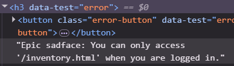
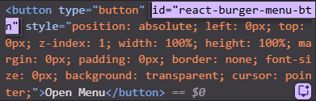

Questions-1
-----------------------------------------------------------
>For username i found locator :data-test="username"
>For password i found locator :data-test="password"
>For click the login button :data-test="login-button"
But there is an error like: 
so i try to verify the visible error message and my expected error are same

Questions-2
------------------------------------------------------------
>For finding humburger menu i found a id :
>for resetting app state i use id: reset_sidebar_link
>to close the humburger menu i click :react-burger-cross-btn
>i use for every input- unique page locator and click 
>declare any variable that need to store element data

Question-3
------------------------------------------------------------
>i use page.locator and page.click to find the and press the exact element
>i need a variable to store the total price and product name elements data , so i declare these variable .